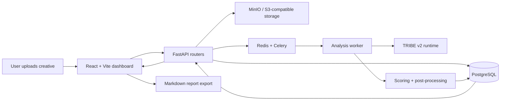

# NeuroMarketer

**Pre-flight creative intelligence for ads, landing pages, and campaign assets.**

NeuroMarketer helps teams answer one expensive question before they spend media budget:

> Should we ship this creative, fix it, or kill it?

It turns video, audio, and text assets into a decision dashboard with attention signals, memory proxies, cognitive-load risk, benchmark context, recommendations, comparison views, and a shareable report.

## Why It Is Different

Most creative review is either subjective feedback in a meeting or post-launch analytics after money has already been spent. NeuroMarketer sits before launch.

- It accepts real creative assets, not only prompts or screenshots.
- It runs an asynchronous analysis pipeline instead of blocking the UI.
- It combines model signals, structured post-processing, internal benchmarks, and optional LLM critique.
- It gives a top-level verdict first: **Ship**, **Fix**, or **Kill**.
- It exports a clean Markdown report that a founder, marketer, or client can read without opening the app.

## What Is TRIBE v2?

`facebookresearch/tribev2` is the model layer behind the core inference path. In this project, TRIBE v2 is used as a multimodal signal extractor for creative assets. NeuroMarketer wraps those signals in product logic: job orchestration, scoring, benchmark context, recommendations, visual dashboards, and exportable decision reports.

TRIBE v2 is not treated as a magic conversion oracle. The app presents its output as directional pre-flight evidence, then makes the uncertainty visible through confidence labels, benchmark notes, calibration warnings, and clear limitations.

## Demo Flow

1. Upload a video, audio file, pasted copy, or document.
2. Pick the campaign goal and channel.
3. Start analysis and watch the job lifecycle: queued, processing, post-processing, ready.
4. Read the decision card: verdict, confidence, top risks, and recommended fixes.
5. Inspect score radar, timeline, weak segments, heatmap frames, and recommendations.
6. Compare against another completed analysis.
7. Export a shareable Markdown report for GitHub, LinkedIn, client review, or team discussion.

## What Works Today

- Account/session flow with workspace and project context.
- Upload handling for video, audio, pasted text, and common document formats.
- FastAPI backend with SQLAlchemy repositories and Alembic migrations.
- Async job execution through Celery, with an in-process fallback for local development.
- PostgreSQL, Redis, and MinIO local infrastructure through Docker Compose.
- TRIBE v2 runtime integration with defensive progress-output suppression for worker stability.
- Result dashboard with executive verdict, metrics radar, timeline, segments, recommendation cards, benchmarks, calibration context, and comparison actions.
- Optional LLM evaluation pipeline through Ollama or OpenAI-compatible providers.
- Markdown report export from completed analysis results.

## Technical Architecture



## Stack

- **Frontend:** React 19, TypeScript, Vite, Material UI
- **Backend:** FastAPI, SQLAlchemy, Alembic, Celery
- **Infrastructure:** PostgreSQL, Redis, MinIO locally; S3/R2-compatible storage for deployment
- **Model layer:** `facebookresearch/tribev2`
- **Optional evaluation:** Ollama or OpenAI-compatible LLM endpoints
- **Observability foundation:** structured logging, Prometheus-style metrics, telemetry hooks

## Repository Layout

- `frontend/` - React dashboard, analysis workflow, comparison UI, settings screens.
- `backend/` - API, workers, database models, application services, repositories, model integration, LLM pipeline.
- `backend/tests/` - focused backend tests for security, contracts, job lifecycle, pipeline state, and model-path behavior.
- `docker-compose.yml` - local API, worker, PostgreSQL, Redis, and MinIO stack.
- `todo.txt` - current Stage 1 demo-polish and Stage 2 MVP roadmap.

## Quick Start

### Prerequisites

- Docker and Docker Compose
- Node.js 20+ and npm
- Enough disk space and startup time for model/runtime caches
- Optional: Ollama or an OpenAI-compatible endpoint for qualitative LLM evaluations

### Start Backend Stack

```bash
docker compose up --build
```

This starts:

- API: `http://localhost:8000`
- API docs: `http://localhost:8000/docs`
- PostgreSQL: `localhost:5432`
- Redis: `localhost:6379`
- MinIO API: `http://localhost:9000`
- MinIO console: `http://localhost:9001`

### Start Frontend

```bash
cd frontend
npm install
npm run dev
```

Open `http://localhost:5173`.

Vite proxies `/api/*` to `http://127.0.0.1:8000` during local development. For split deployments, set `VITE_API_BASE_URL`.

## Backend Health Checklist

Before recording a demo or posting the project publicly, confirm:

- `docker compose up --build` starts API, worker, Postgres, Redis, and MinIO.
- `http://localhost:8000/docs` loads.
- The worker logs show Celery mode or the API falls back to local in-process job execution.
- Upload finalization succeeds for one small text or video asset.
- A completed analysis returns a dashboard result rather than only a completed job status.
- Failed jobs show readable messages in the UI, not raw Python tracebacks.
- No private `.env` or production secret file is committed.

## Run Checks

Backend tests:

```bash
docker compose exec api python -m unittest discover backend/tests
```

Frontend checks:

```bash
cd frontend
npm test
npm run build
```

Formatting/linting:

```bash
ruff check --fix . && ruff format .
```

## Known Limitations

- Scores are directional decision support, not guaranteed conversion predictions.
- Benchmarks are only as strong as the completed-analysis cohort available in the workspace.
- Calibration improves when real post-launch outcome data is imported.
- Heavy video/model runs can take time on first startup because model dependencies and caches may initialize.
- Public deployment still needs production-grade secrets, object-storage policy, CI, monitoring, and retention controls.

## Why This Is Interesting

Creative teams already know the pain: launch three variants, wait for spend, discover the hook was weak, then repeat. NeuroMarketer aims to move part of that learning loop earlier. The app gives marketers a structured pre-flight review: which asset looks strongest, what needs fixing, and what evidence supports the decision.

For GitHub, this is a full-stack AI product architecture: React UX, FastAPI services, async workers, model runtime isolation, persistence, comparison, and report generation.

For marketers, it is a sharper workflow: **upload creative -> get verdict -> fix weak moments -> compare variants -> share the decision.**

## License And Contributions

This project is currently an MVP/demo codebase. Add a license before publishing it as open source. Contributions should preserve the product promise: make creative decisions faster, clearer, and more trustworthy before ad spend is committed.
